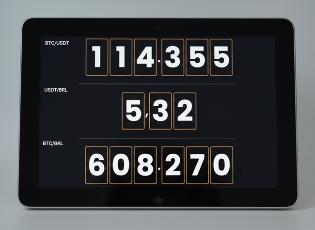

# iPad BTC Clock

A sleek, server-rendered digital clock and cryptocurrency price display, optimized to bring new life to any device, especially older iPads running iOS 9.3.5.

**🔗 Live Link: https://btc-clock.21m.workers.dev/**

## The Approach: How It Works

This project uses a modern, server-side rendering (SSR) architecture powered by **Cloudflare Workers** to ensure maximum compatibility and performance on any device.

1.  **Server-Side Logic:** A Cloudflare Worker fetches live price data for `BTC/USDC` and `BTC/BRL` from the Coinbase public API.
2.  **On-the-Fly Rendering:** The worker performs all calculations and generates the final, styled HTML page on the server.
3.  **Ultra-Lightweight Delivery:** Your device receives a simple, pre-rendered HTML page. The browser's only job is to display it, requiring minimal processing power.

This approach offloads all the heavy lifting from the device, making the panel fast and responsive even on very old hardware like an iPad 2.

## Features

-   **Live Prices:** Displays `BTC/USDC`, `USDC/BRL` (calculated), and `BTC/BRL`.
-   **Server-Side Rendering:** Guarantees compatibility with virtually any web browser, new or old.
-   **Efficient Caching:** The worker caches API results to prevent rate-limiting and ensure near-instant load times.
-   **Automatic Refresh:** The page automatically updates every 60 seconds.
-   **Digital Placard Design:** A clean, high-contrast layout inspired by the iconic Blockclock by Coinkite.

## How to Use

1.  Visit **https://btc-clock.21m.workers.dev/** on your tablet or any other device.
2.  For the best experience on a tablet, rotate to landscape mode.
3.  Tap the "Share" button in Safari and select "Add to Home Screen" for a full-screen, app-like experience.

## Deployment

This project is configured for **automatic deployment**. A direct integration between GitHub and Cloudflare means that any push to the `main` branch automatically triggers a new build and deploys the latest version of the worker.

## Design Inspiration

This project draws its aesthetic firepower from the legendary [Blockclock](https://blockclock.com) and the iconic creations of **Coinkite** — hardcore builders who etched their mark into Bitcoin history.

-   Blockclock

---

This project breathes new life into old iPads by turning them into a sleek, efficient, and always-on cryptocurrency price panel.
